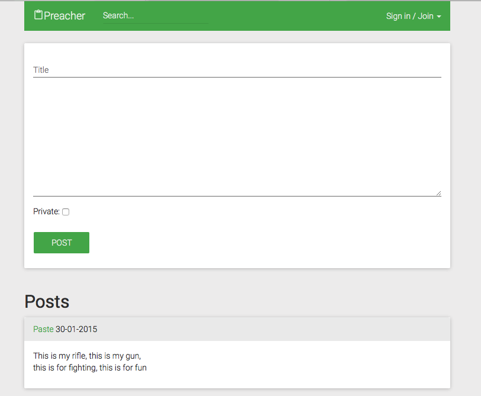

# Preacher

simple pastebin example with meteorjs framework

## Start

	git clone https://github.com/noroot/preacher
	meteor

## Configuration

This projects has no configuration, except kadira.io monitoring which is optional.
You can put settings to settings.json in json format or to server/kadira.js with javascript to start work with kadira
		

## Screenshot

It should looks like this when it works

